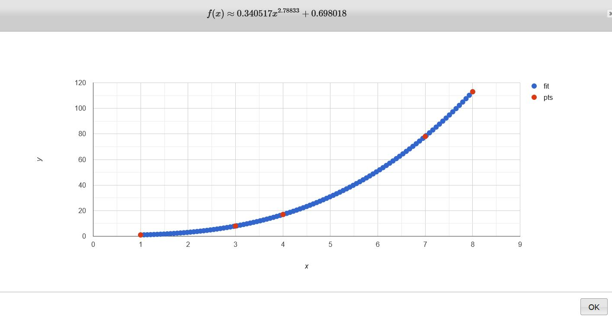

# Q Change Assignment
    POSTMAN:  https://www.getpostman.com/collections/4a4081146295e7293011

### Assignment #1 หาค่าของ XYZ
    SOURCE: /src/xyz
        
    คิดไม่ออกว่าตัวเลขมันมาจากสมการอะไร เลยเอาตัวข้อมูลไปใส่ใน https://www.dcode.fr/function-equation-finder
    ตอนใส่ข้อมูล กำหนดให้ x เป็นลำดับตัวเลข และ y เป็นค่าของตัวเลข (เอาเฉพาะที่ไม่ติดตัวแปร)
    จะได้ออกมาเป็นคู่อันดับแบบนี้ (1,1), (3,8), (4,17), (7, 78), (8, 113)
    และเลือก TARGET AND CALCULATION METHOD เป็น POWER (INCLUDING INVERSE AND NTH ROOT) USING CURVE FITTING)
    จริงๆลองหลายๆตัวแล้ว อันนี้ดูจะพอดีที่สุด
    หลังจากใส่ข้อมูลแล้วก็กด FIND A MATCHING EQUATION แล้วมันก็ออกมาเป็นสมการข้างล่าง

#### Assignment #2 Cashier Service
    SOURCE: /src/cashier

    ใน service จะมีอยู่ 2 func หลักๆ
    - ChangeMoney(ctx context.Context, d *dao.ChangeMoneyRequest) (*dao.ChangeMoneyResponse, error) ใช้สำหรับคำนวญเงินทอนและปรับจำนวนเหรียญที่เหลืออยู่ การทำงานคร่าวๆคือ รับข้อมูลราคาสินค้า และยอดเงินที่ลูกค้าจ่าย แล้วนำมาคำนวญว่าต้องทอนเหรียญอะไรกลับไปบ้าง จำนวนเท่าไหร่ ในกรณีที่เหรียญไม่พอจ่ายจะแจ้ง error 

    - AddCoins(ctx context.Context, d *dao.AddCoinRequest) (*dao.AddCoinResponse, []error)
    ใช้สำหรับเพิ่มจำนวนเหรียญ แต่เพิ่มได้ไม่เกิน maximum ของเหรียญนั้น
